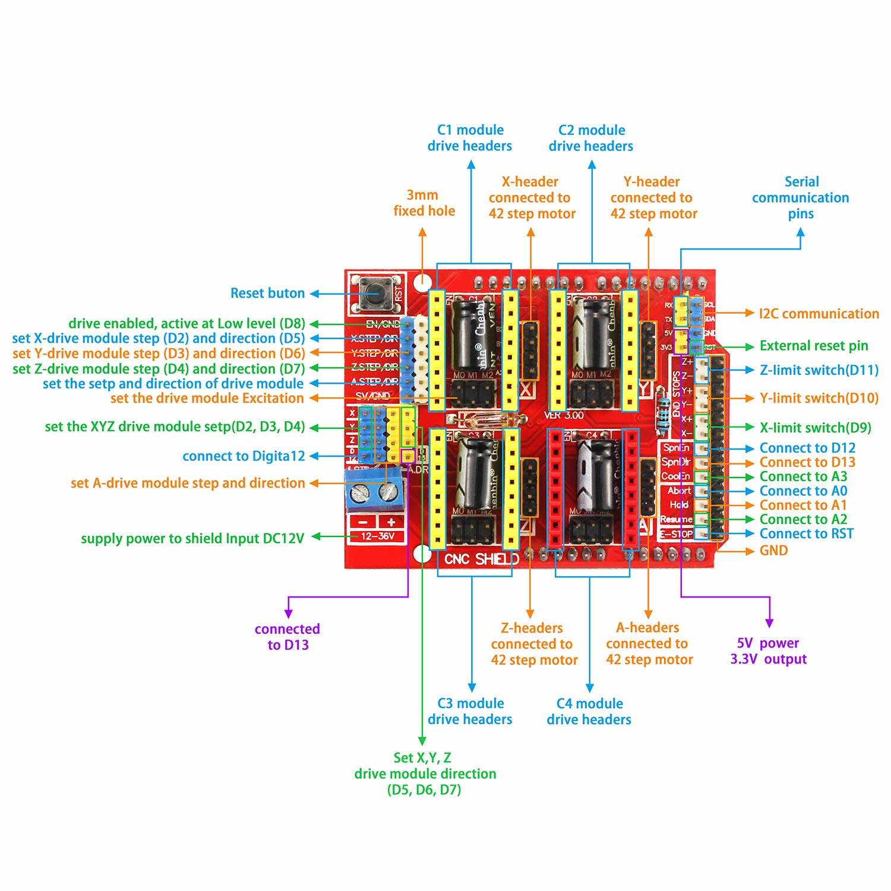
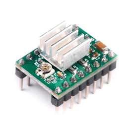
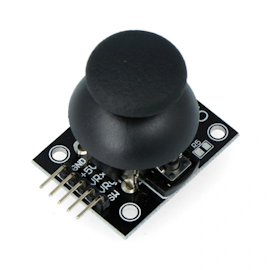
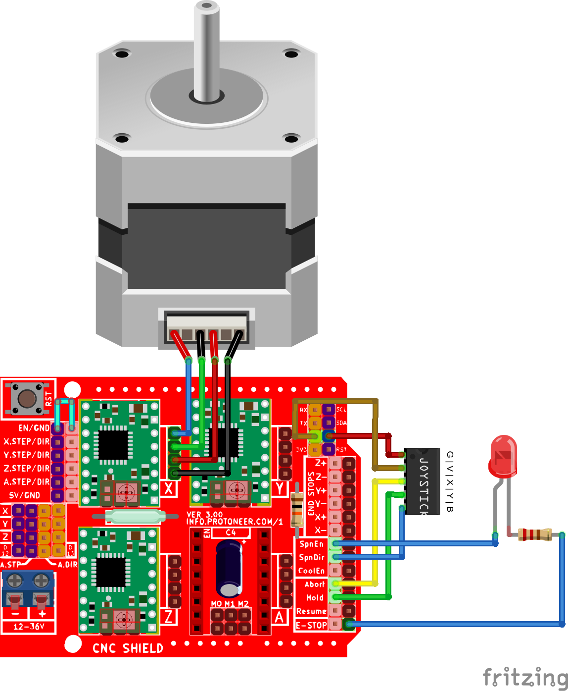

Arduino + CNC Shield + Stepper motors v1.0
===

A simple project to control 3 stepper motors using [Arduino](https://www.arduino.cc/) and a CNC shield. Stepper motors are controlled by a joystick.

Joystick X and Y axes control X and Y stepper motors in the default mode. When a joystick is pressed for 500 ms it switches the mode to z-mode and turns the LED on. Joystick Y axis controls the Z stepper motor. After another press for 500 ms it goes back to the default mode.

Required elements
---

- Arduino UNO,
- CNC shield,
- at least 3 stepper motors,
- at least 3 A4988 drivers.

CNC shield
---

A4988 driver
---

Joystick
---

Connections
---

